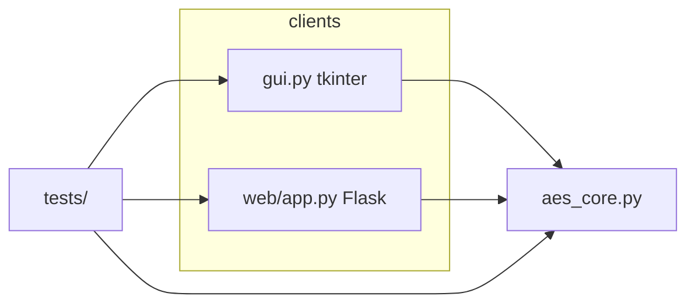

# How This Project Works

This document explains the **AES-128 educational toolkit** end to end: the cryptography core, the desktop GUI, the Flask web app, and how tests verify correctness. It is written for anyone taking over or reviewing the code.

---

## 1. Purpose

The project implements **AES-128** exactly as in [FIPS 197](https://csrc.nist.gov/publications/detail/fips/197/final): one 128-bit key, one 128-bit block, 10 rounds (plus an initial AddRoundKey). There are **no third-party crypto libraries**—only Python’s standard library for the GUI and Flask for the web layer.

Users enter keys and data as **32 hexadecimal characters** (128 bits). The tools show **4×4 byte states** (the internal representation AES uses) and support **encrypt**, **decrypt**, **single-round stepping**, **avalanche analysis**, and **key schedule display**.

---

## 2. High-level architecture

- **`aes_core.py`** — All AES math: tables, key expansion, round functions, helpers for round-by-round states and avalanche bit counts.
- **`gui.py`** — A single window with tabs; each tab calls into `aes_core`.
- **`web/app.py`** — HTTP routes; templates render the same logical flows as the GUI.
- **`tests/`** — Pytest suite (NIST vectors, round trips, GUI/Flask smoke tests).

---

## 3. Data representation

### 3.1 Hex input

Functions `parse_hex_block` and `parse_hex_key` accept a string, strip spaces and newlines, require **exactly 32 hex digits**, and return **16 bytes**.

### 3.2 State matrix (4×4)

AES treats a 16-byte block as a **column-major** grid:

- Byte index in the block: column `c`, row `r` → `block[c*4 + r]`.
- In code: `state[r][c]` is the byte at row `r`, column `c`.

`bytes_to_state` and `state_to_bytes` convert between 16 raw bytes and this grid.

### 3.3 Round keys

`key_expansion(key)` builds **11** round keys (index `0` … `10`). Each round key is also a 4×4 matrix of bytes, matching the state layout. AES-128 uses **44 key words** (4 words × 11 round keys); `words_to_hex_words` formats them as eight hex characters per word, grouped as **4 words per round key** for display.

---

## 4. What `aes_core.py` does (function by function)

| Function | Role |
|----------|------|
| `SBOX`, `INV_SBOX`, `RCON` | Standard AES substitution tables and round constants. |
| `sub_bytes`, `shift_rows`, `mix_columns`, `add_round_key` | The four round operations (forward and inverse where needed). |
| `_gf_mul` | Multiplication in GF(2⁸) with reduction polynomial 0x11B, used by `mix_columns`. |
| `key_expansion` | NIST key schedule: 4 initial words from the key, then iterate with RotWord, SubWord, and XOR with `RCON` on every fourth word; reshape into 11 round-key matrices. |
| `encrypt_block` / `decrypt_block` | Full single-block encrypt/decrypt using the expanded round keys. |
| `encrypt_block_with_rounds` / `decrypt_block_with_rounds` | Same as above but return a **list of 11 states**: the state **after** each “round boundary” as defined in this implementation (initial AddRoundKey counts as round 0’s output state, through final ciphertext/plaintext). |
| `one_round_steps` | For **one chosen round index** `0…10`, returns named steps and a copy of the state after each step (SubBytes, ShiftRows, MixColumns if not round 10, AddRoundKey). Round 0 is only the initial AddRoundKey. |
| `bit_mismatch` | Counts differing bits between two 4×4 states (for avalanche). |
| `state_to_hex_grid` | Pretty-print one state as four lines of hex bytes. |

**Encrypt flow (conceptually):** AddRoundKey(0) → for rounds 1–9: SubBytes → ShiftRows → MixColumns → AddRoundKey → round 10: SubBytes → ShiftRows → AddRoundKey(10) (no MixColumns).

**Decrypt** reverses the order and uses inverse operations.

---

## 5. Desktop GUI (`gui.py`)

Built with **tkinter**. Global helpers: **`normalize_hex` / `is_valid_hex_block`** for live validation, **`HexEntry`** for key/block fields with a ✓ when valid, **`make_state_grid`** to draw a 4×4 state.

| Tab | Behavior |
|-----|----------|
| **1. Single round** | User sets key, block, and round `0–10`, then **Load round**. **Next/Previous step** walks through `one_round_steps` output so each AES operation is shown one at a time. |
| **2. Full AES** | Encrypt or decrypt one block; output includes hex result and **state after each round** from `encrypt_block_with_rounds` or `decrypt_block_with_rounds`. |
| **3. Avalanche** | Mode A: same key, two different blocks. Mode B: same block, two different keys. Both runs use `encrypt_block_with_rounds`; each round pair is compared with `bit_mismatch` (0–128). |
| **4. Key expansion** | Shows 11 lines, each with **4 words** in hex from `words_to_hex_words`. |
| **5. S-box / Rcon** | Read-only tables for teaching. |

Menus: **File → Run self-test** checks the NIST Example vector; **View → Dark theme** toggles styling; **Help** explains input format.

---

## 6. Web app (`web/app.py`)

**Flask** serves HTML from `web/templates/` and static assets from `web/static/`. Routes mirror the GUI:

| Route | Purpose |
|-------|---------|
| `/` | Home with links. |
| `/single-round` | POST: run `one_round_steps`, show all steps on the page. |
| `/full-aes` | POST: encrypt or decrypt; show per-round state grids. |
| `/avalanche` | POST: same logic as GUI avalanche tab. |
| `/key-expansion` | POST: show grouped round keys. |
| `/sbox` | S-box, inverse S-box, Rcon list. |

**JSON helpers** (for scripts or UI buttons):

- `GET /api/random-key`, `GET /api/random-block` — 32 hex chars.
- `GET /api/self-test` — runs NIST encrypt/decrypt check, returns `{ "passed", "message" }`.

The app adjusts `sys.path` so `aes_core` imports from the project root when you run `python3 web/app.py`.

---

## 7. Tests (`tests/`)

- **`test_aes_core.py`** — Parsing, state roundtrip, expansion, encrypt/decrypt, per-round lists, `one_round_steps` for rounds 0, 1, and 10, `bit_mismatch`, hex grid helpers.
- **`test_nist_vectors.py`** — FIPS 197 Appendix C.1–style known answer and a zero-key sanity round-trip.
- **`test_parsing.py`**, **`test_key_expansion_detail.py`**, **`test_encrypt_decrypt_roundtrip.py`**, **`test_one_round_steps.py`**, **`test_avalanche.py`** — Additional edge cases and invariants.
- **`test_gui_import.py`** — Ensures `gui.py` imports and hex helpers behave.
- **`test_flask_app.py`** — Loads the Flask app and hits main routes and an encrypt POST.

**`tests/run_all_tests.py`** runs pytest over `tests/` and prints a clear pass/fail summary.

---

## 8. Correctness guarantee

The implementation is meant to match **FIPS 197**. The **NIST test vector** embedded in `gui.py` and `web/app.py` (key `2b7e15…`, plaintext `3243f6…`, ciphertext `392584…`) is checked by tests and by the in-app self-test. Passing the full test suite means core behavior, including key schedule and inverse cipher, is consistent with that standard.

---

## 9. Files quick reference

| Path | Contents |
|------|----------|
| `aes_core.py` | AES-128 engine only |
| `gui.py` | Desktop application |
| `web/app.py` | Flask server |
| `web/templates/*.html` | Pages for each tool |
| `requirements.txt` | `flask`, `pytest` pins |
| `docs/HOW_IT_WORKS.md` | This document |
| `docs/CLIENT_DELIVERY.md` | Handoff checklist |
| `docs/PROJECT_PLAN.md` | Original week-by-week plan |

For day-to-day usage, start with the **README.md** at the project root.
